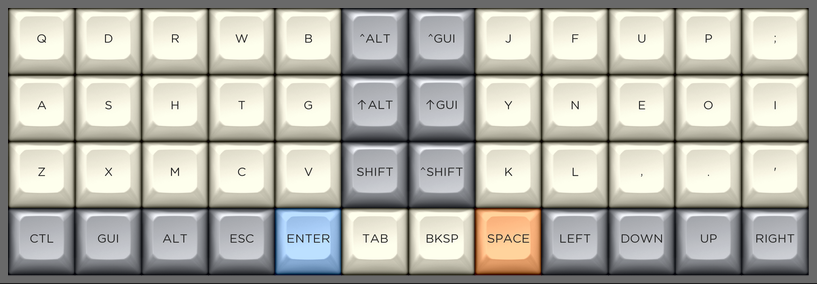
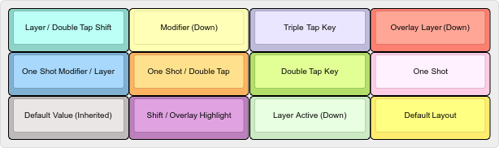
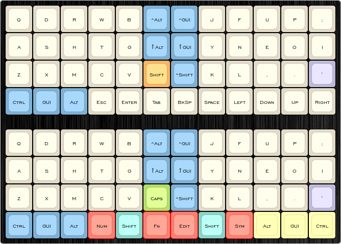
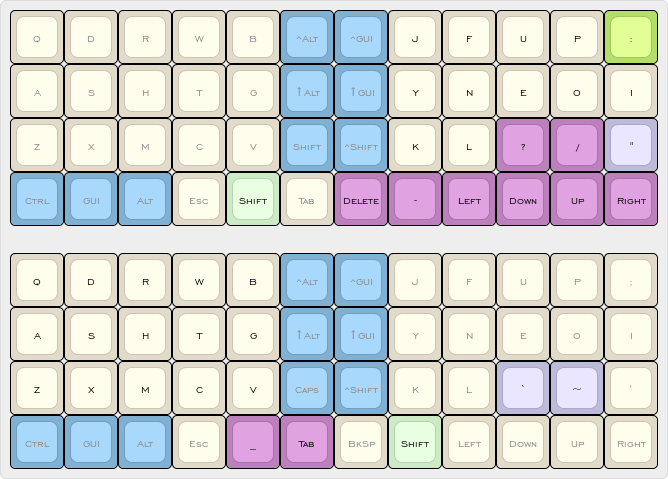
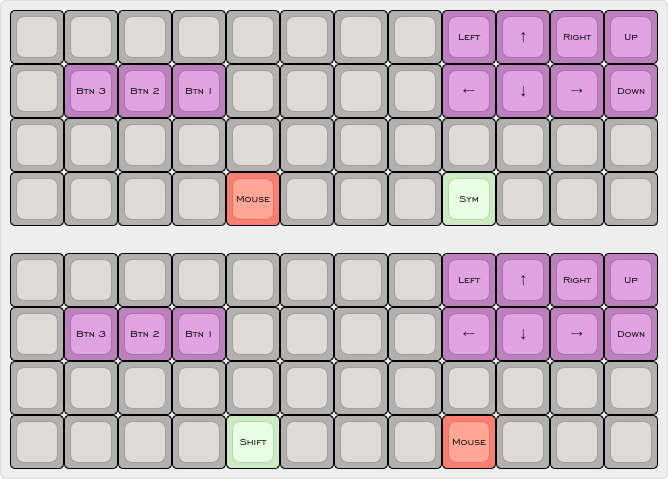

# Libbum's Planck Configuration

Working from the [default configuration](https://github.com/qmk/qmk_firmware/tree/master/keyboards/planck/keymaps/default) of the QMK firmware, this layout will at some stage in the future be used for my Planck.

Inspiration from [sdothum](https://github.com/sdothum/dotfiles/tree/master/qmk_firmware/qmk_firmware/keyboards/planck/keymaps/sdothum) and [ojbucao](https://github.com/ojbucao/Workman/tree/master/mac).

# Layout

At the moment, it's a work in progress and probably not what you want to use.

## Legend

## Basic layers using an en_AU locale, Workman center split layout

## Shift layers

## Mouse layers

# Building

`sudo make planck-rev4-libbum-dfu` from the `qmk_firmware` directory.

