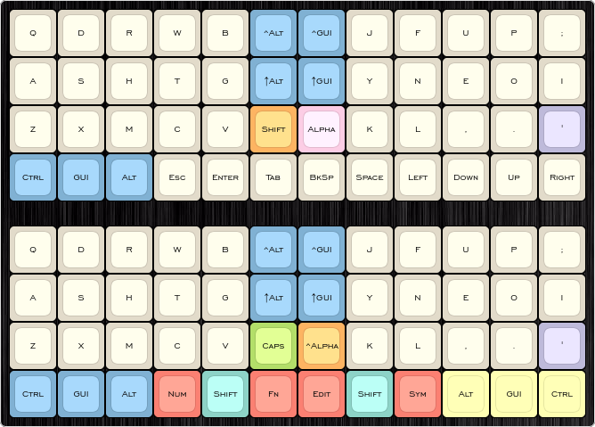
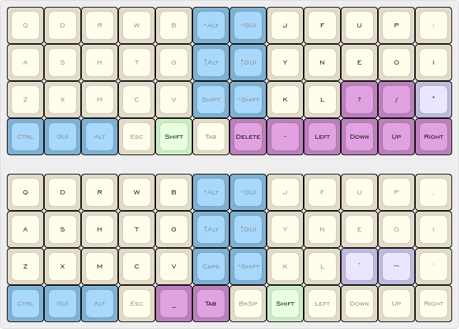

# Libbum's Planck Configuration

Working from the [default configuration](https://github.com/qmk/qmk_firmware/tree/master/keyboards/planck/keymaps/default) of the QMK firmware, this layout will at some stage in the future be used for my Planck.

Strongly influenced by [sdothum](https://github.com/sdothum/dotfiles/tree/master/qmk_firmware/qmk_firmware/keyboards/planck/keymaps/sdothum).
May investigate some ideas [ojbucao](https://github.com/ojbucao/Workman/tree/master/mac) in the future.

## Legend

## Basic layers using an en_AU locale, Workman center split layout

## Shift layers

## Alpha layers

## Numeric layers

## Symbol layers

## Function layers

## Mouse layers

# Building

`sudo make planck/rev4:libbum:dfu` from the `qmk_firmware` directory.

# Unfinished Features / TODO

* [ ] Unicode aware, Swedish extra characters and common math symbols
* [ ] Latex and other common programming macros

## License

